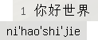
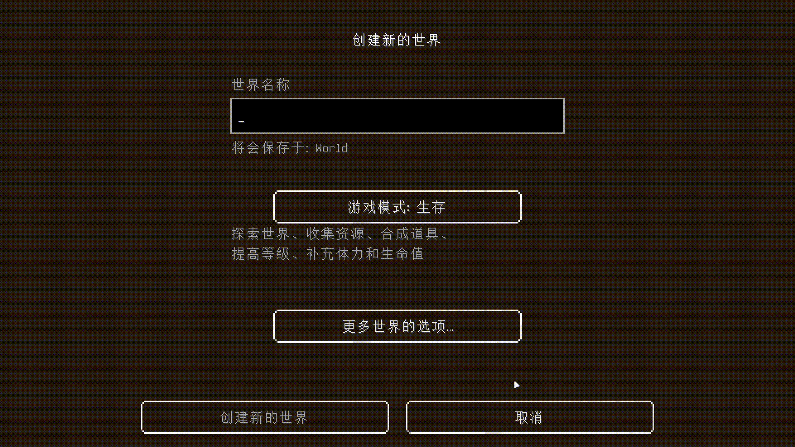

# IngameIME for 1.8.9

Use `InputMethod` in **Full screen** Minecraft!

## Preview

### Window Mode

> This style is the same with Full screen Mode

### Full screen Mode

## Special Thanks

- [Windmill-City](https://github.com/Windmill-City): Mod founder

## Supported Platforms

| Platform | Supported |
| -------- | --------- |
| Windows  | √         |
| Linux    | ×         |
| MacOS    | ×         |
